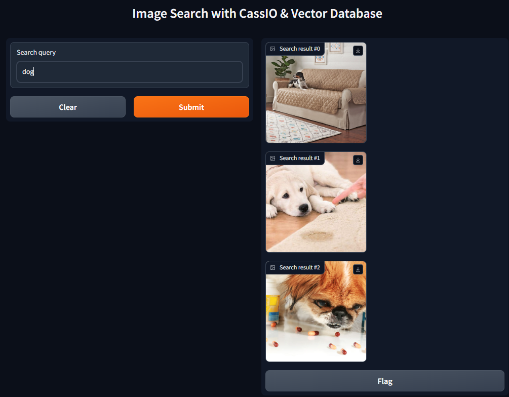
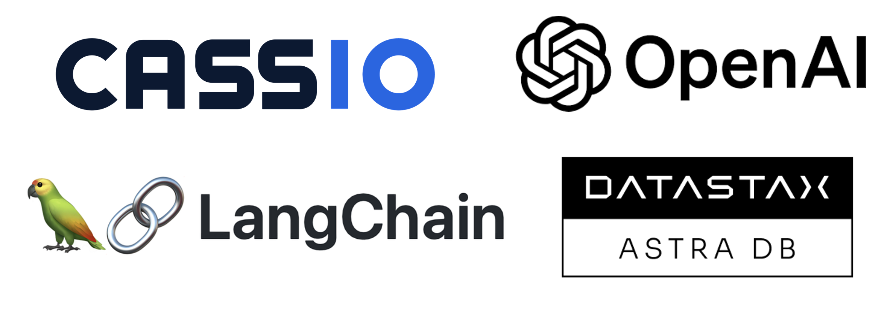

# Image Search using Keywords

This repository contains code to create an **image search app** that can be used to (1) store image embeddings in a vector database, and then (2) retrieve images using keyword search.

<details><summary><b>Show more details</b></summary>

Here is an example of a set of search results for the query "dog".

<p align='center'>
	
</p>

The query returns three top results from all images available in the vector store.

The following tools are used to create this app: [CassIO](https://cassio.org/), [LangChain](https://www.langchain.com/), [OpenAI](www.openai.com), and [AstraDB](https://www.datastax.com/products/datastax-astra) as the vector database.

<p align='center'>
	
</p>

</details>

## Instructions to Launch the App 🚀

<details><summary><b>Show instructions</b></summary>

Once you make a copy of this codebase on your computer, activate a Python virtual environment using the following command:

`python -m venv .venv`

Once the Python virtual environment is created, activate it and install all dependencies from `requirements.txt`.

`source ./.venv/bin/activate`

`pip install -r requirements.txt`

Once all dependencies are installed, please follow the instructions below to run this app.

</details>

## Secrets 🔑

<details><summary><b>Show config settings</b></summary>

You will need a file called `.env` in the project's home directory. You can use the template file, `.env.template` and fill in the appropriate details. You will need the following:
```
ASTRA_DB_ID
ASTRA_DB_APPLICATION_TOKEN
ASTRA_DB_SECURE_BUNDLE_PATH
ASTRA_DB_KEYSPACE
OPENAI_API_KEY
```

Please follow the instructions on [this page](https://cassio.org/start_here/) to create a free vector database and get login credentials/secrets. This will cover the first four items listed in `.env.template`. In addition, you will need an API key from [OpenAI](https://openai.com/).

</details>

## How It Works ⚙️

<details><summary><b>Show details</b></summary>

1. The first step is to download some images from the internet. The easiest way to do this is by using `fastai`'s `search_images_ddg()` function that allows us to serach for images on the internet using a keyword. In `00_download_images.py`, I extract upto eight images for each of the following keywords: pet, sports, car, bird, and baby. Feel free to change those settings as you see fit. 

	Before running the script, create a directory called `images` to store raw images. When ready, you can run the script by using the following command:

	```
	python src/00_download_images.py
	```

	Once the script finished running, please view the images to make sure that they are valid. You may find that some of those images are not being rendered. Please delete those images.

2. The next step is to create embeddings for all of these images that we've downloaded. We use `OpenAIEmbeddings()` for this purpose. The code for this step is available in `02_create_vectors.py`. Here's how it works:

* First, we set all environment variables that we will need to connect with the vector database and OpenAI.
* We use LangChain's `ImageCaptionLoader()` to create image captions for each image. The captions are created by using the pre-trained **Salesforce BLIP** image captioning model. These captions are then converted into embeddings using OpenAI's `OpenAIEmbeddings()`. _[Please note that alternatively we could use the CLIP model to convert the raw image into embedding.]_
* We then use LangChain's `VectorstoreIndexCreator()` to create an index and store all embeddings into a vector store.
	```
	index_creator = VectorstoreIndexCreator(
		vectorstore_cls=Cassandra,
		embedding=OpenAIEmbedding(),
		vectorstore_kwargs={
			'session': session,
			'keyspace': keyspace,
			'table_name': table_name,
		},
	)

	```

	There's no need to make any changed in this script. You can directly run it by using the following command:
	```
	python src/02_create_vectors.py
	```
3. _[Optional Step]_ Once the embeddings are loaded into the vector database, you can run the following to ensure that you can query the database:
	```
	python src/03_check_db.py
	```

4. The final step is to search within the vector database using a search query (such as "pet") and retrieve images that match that search criterion. This is done by using a (locally deployed) Gradio app, which can be invoked by running the following command:
	```
	python src/04_retrieve.py
	```

	Once the app is launched in a browser, you can experiment with different search keywords.

>IMPORTANT NOTE: Currently, the top three results (matches) are returned and displayed on the app. Sometimes, you may see that the matched images are not relevant to the search query. This is because I have not included a filter to discrad images based on a similarity threshold.

</details>

## Potential Improvements 💡

<details><summary><b>Show details</b></summary>

1. Filter out irrelevant results (set of images that are not relevant to the search query) based on a confidence threshold.
2. Sort the results from high to low confidence.
3. Include some error handling. Currently, there are no proper safeguards against invalid image files. Once the images are downloaded in `./images/` directory (by running `00_download_images.py`), you would have to manually delete corrupt images.
</details>

### Sources 🔎 

<details><summary><b>Show credits</b></summary>

[VectorStore/QA](https://cassio.org/frameworks/langchain/qa-advanced/)

[Image Similarity Search with Vector Database](https://cassio.org/frameworks/direct_cassio/image_similarity_vectors/#compute-and-store-embedding-vectors-for-images)
</details>
